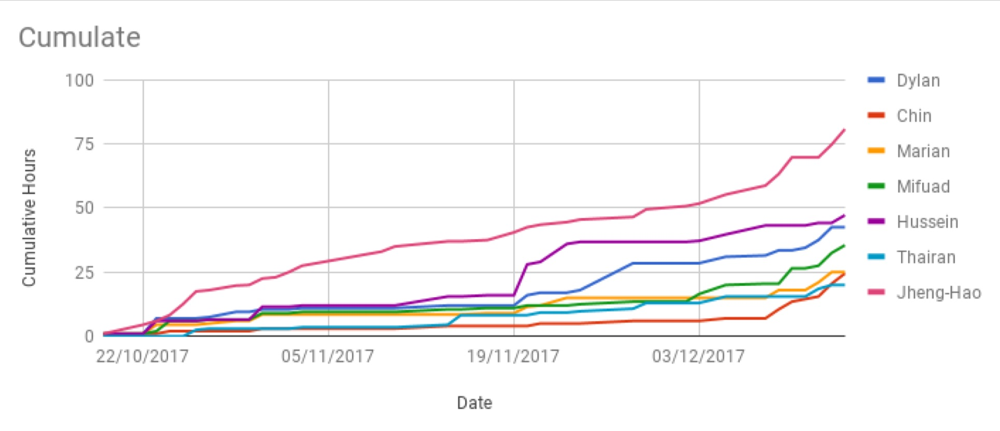
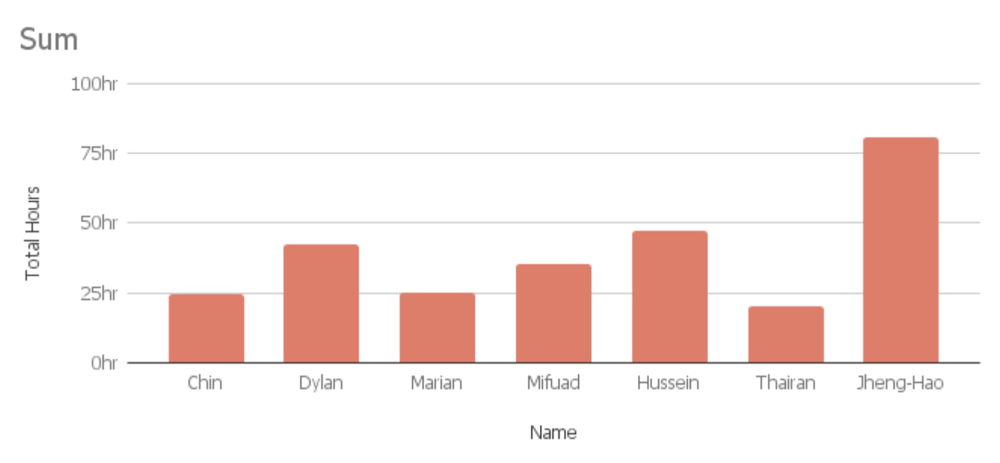

# 12.Appendices

# 1. User Need Overview & Concept Introduction

---

# 2. Data gathering and requirements

---

# 3. Functional Specification

---

# 4. Ethical audit 

---

# 5. Design

## 5-1. Use Cases Details

### Use case 1: Log trackers

#### Basic Flow

  1. User attachs Tracker to a personal item.
  1. App links to Tracker with bluetooth.
  1. App activates Tracker.
  1. User logs details of the item and Tracker in App.
  1. App validates and saves the inputs.

#### Alternative Flows

[Multiple Trackers]
After Step 4, repeat step 1 to 4 for additional Trackers and items.

### Use case 2: Monitor Tracker

#### Basic Flow

1. App listens for signal at regular intervals.
1. App saves the history of the position of Tracker at regular intervals.

#### Alternative Flows

[Tracker is with user]
Tracker is within certain distance from User:

1. App listens for bluetooth singal.

[Tracker is lost]
Tracker is not within certain distance from User:

1. App activates Tracker's cellular mode via bluetooth.
2. App sends a notification to mobile OS to nofity User.
3. App listens for the geolocation data of Tracker sent from Server.

[Tracker is nearby but not with User after being lost]
Tracker is within bluetooth dectable distance after being far away from User :

1. App activates Tracker's bluetooth mode via Server.
1. App listens for the geolocation data of Tracker sent from Server and bluetooth singal at the same time.

[Tracker is with User after being lost]
1. App deactivates Tracker's cullular mode via bluetooth.

Resume at Base Flow step 1.

### Use case 3: Track Item

#### Basic Flow

1. User selects desired tracking item in App.
1. App displays the position data of Tracker.

### Use case 4: Send position data

#### Basic Flow

1. Tracker sends position data to App.

#### Alternative Flows

[Activates Cellular mode]
Tracker's bluetooth signal is not reaching App after a period of time: 
1. Tracker activates cellular mode.

[Bluetooth mode is activated]
Tracker sends position data via bluetooth to App.

[Cellular mode is activated]
1. Tracker sends position data via cellular to Server.
1. Server transfer the position data to App.

### Use case 6: Register account

#### Basic Flow

1. User input account details.
1. App validates the inputs.
1. App creates a new account.

#### Alternative Flows

[Inputs are validated failed]
After step 2, resume at step 1 if the inputs are not validated.

### Use case 7: Login account

#### Basic Flow

1. User input account details.
1. App validates the inputs.
1. App allows User to login.

#### Alternative Flows

[Inputs are validated failed]
After step 2, resume at step 1 if the inputs are not validated.

---

# 6. Prototyping

---

# 7. Technical Architecture

---

# 8. Evaluation Plan

---

# 9. Project management


## 9-1 Project Tasks List


## 9-2 Meeting notes

### Weekly Routine

|Time| Task | Task Description | Total Duration |
|---|---|---|---|
Tuesday Morning | Lab Meeting | Report everyone's previous working status and plan for the Individual Working Slot 1. | 1 hour
Tuesday to Thursday | Individual Working Slot 1 | Working on the plan discussed in Lab Meeting. | 4 hours
Friday Noon | Supervised Meeting | Report the working result and consult with the supervisor. | 0.5 hour
Friday to Monday | Individual Working Slot 2 | Improve one the working result based on the Supervised Meeting. |  4 hours

### Supervised Meeting - 7/12/2017

* Walked through the proposal requirements.
* Tim suggested us to 
	* Build a wood made tracker as a physical usage prototype to test the usage of our tracker. 
	* Add extreme tests in the evalutaion section

### Lab Meeting - 5/12/17 

* Have asked hatchlab about purchasing hologram.
* Need to buy hologram on our own.
* Discuss what to do during the Christmas break on 12/12.

### Supervised Meeting - 30/11/2017

* Grilled over the technical diagrams.
* We need to catch up on hours.
* Tim likes our project.

### Supervised Meeting - 24/11/2017

* Tim said: "Where are the prototypes???" 
* The meeting time has now changed to Thursday 12:00.
* Suggestion: 
	* Separate the process diagram into different part to fit them in the proposal.

### Lab Meeting - 21/11/2017

* How to integrate Skyhoot:  @hussein159 works on that.
* Platform: Android
* Functional Prototype: @hussein159 works on that.
* To put data privacy issue in proposal while using the skyhook or any cloud service.

### Supervised Meeting - 17/11/2017

* Updated progress tracking form with milestone / tasks.
* People who commit more will have more marks, please record your effort on the progress tracking form and proactively pick the tasks if you need more marks.
* Changing time of the meeting may be quite difficult.
* Tim suggested to host another meeting time during the week apart from the lab.

### Supervised Meeting - 03/11/2017

* What we've done:
	* Meeting with Pete.
	* Hardware research.
	* About to attend the hatch lab induction.

* What we have not done:
	* Improve the previous report.
	* Estimote testing report.

### Meeting with Pete - 31/10/2017

* To discuss: 
	* Anyway to improve on our idea?
	* Any suggestion on the hardware?
	* How to compete with competing products?


### Supervised Meeting - 27/10/2017

* Try to build a prototype before next meeting.
* Search what's the techniques the existing products use.
* Search what can we use to provide the service.
* Because of age-related memory loss, the elders or middle age people could be our target customers.


### Supervised Meeting - 20/10/2017

* Progress suggestions
	* Before next week: potential user (Draft personas?)
	* Setup a questionnaire to ask who are our users? 

* Preparing for next time:
	* Bring the lab doc / track form (hard copy of the progress sheet).
	* Sketch Functional Architecture 
	* Make sure the requirements are met before next week.
	* Use case senario.
	* Completed resource form.
	* Do the questionnaire in: 
	  * Cafeteria
	  * Costa
	  * Family
	* Think about project names?


### Extra Meeting - 19/10/2017

* Topic decided: **Lost item tracker**
* Product name
	* findME
	* BlueJ
	* locate.
	* Lost.
	* LocationRanger


## 9-3 Progress Tracking Form (until 10/12)

Label Name | Description
|---|---|
WBS Code | Work break down code, which indicates the category of the work for.
Date | The working date.
Status | The detail of the work.
Resource Name(hour) | Usage of the resource(s) in hours.


## 9-4 Progress Tracking Charts (until 10/12)

### Cumulate Line Chart



### Sum Column Chart



## 9-5 Project Management Tools Details

| Platform | Usage
|---|---|
| Slask | Inner communication.
| Trello | Divides and assigns weekly tasks. (depreciated)
| Trello | Records weekly meeting notes.
| Google Spread Sheet| Progress tracking form.
| Google Spread Sheet | Gantt Chart.
| Google Spread Sheet | Project Tasks List.
| Github | Manage source code and report with fixed workflow.
| Github | Use issue feature to track developing progress.
| Github | Record weekly reports.

## 9-6 Github Directories

* `/documents`: The reports for each week progress.
* `/proposal`: Paragraphs for each section of our first report
* `/src`: software/hardwares source code.
* `/presentations`: Slides for the presentation in March.
* `/final-report`: Paragraphs for the final report.

## 9-7 Github Work Flow

If you want to update any document or source code in the repository, please follow **the work flow** and the **naming convention** to maintain the consistency.

### tl:dr

1. [Issue](#1issue)
1. [Branch](#2-1-check-out-the-branch)
1. [Work](#3-work)
1. [Commit](#4-commit)
1. [Push & pull request](#5-push-pull-request)

### 1.Issue

Before you start to work on either document or source code, make sure you **browse the issue section** to see if there is already an existing issue related to what you're going to work on. If you found one, than go to [step 2-1](#2-1-check-out-the-branch). 

If there is no such issue you're looking for, **create a new one then**. Condense the title and add more details in the description. Add the correct label to it and assignees as well. 

> [Read more about the issue labels](#issue-labels)

### 2-1. Check out the branch

Check out the corresponding branch on your local working space. If the issue you found is `#13`, then the branch name should be like `issue-#13-xxxx`. `xxxx` can be `fix` or `update`.

### 2-2. Create a new branch based on that issue.

If you can't find the issue about what you need to work on, create a new one on your own. Here is the naming convention:

`issue-#[ISSUE NUMBER]-[ACTION]`

* NUMBER: the number of the corresponding issue.
* ACTION:
  * `update`: for report updating or feature updating, mainly for something continuously updating.
  * `fix`: for fixing a bug or typo, mainly for something happen one time only.

### 3. Work

As title, work on your branch and make sure you're on the right branch already. You can use `git branch` to check it.

### 4. Commit

To commit, here is the commit message:

```
[TYPE]: [SUBJECT LINE]

[DESCRIPTION]

[ACTION] #[ISSUE NUMBER]
```

* `TYPE`: `Update` or `Fix`. same as the `ACTION` on the branch name
  * `Update`: for report updating or feature updating, mainly for something continuously updating.
  * `Fix`: for fixing a bug or typo, mainly for something happen one time only.
* SUBJECT LINE: briefly describe your changes. 
* DESCRIPTION: describe the change in more details.
* ACTION: 
  * `Close`: to close of the branch and the issue forever (theoretically).
  * `Update`: there should be future updating continuously.
* ISSUE NUMBER: the issue number.

#### e.g. Update the report 

```
Update: Rewrite the project concept.

Condense the project concept and add two new diagrams.

Closes #1234
```

#### e.g. Fix a bug

```
Fix: Added missing header

The app header was deleted accidently, added it back.

Closes #12345
```

> Please review your change before every commit, which will massively reduce the possibility of finding bugs or typos after push the commit.

### 5. Push & pull request

After you push your commit, make a pull request on Github. Everyone can review your change and add comment. After reviewing I will either merge it to the master or ask you to do some change.

### Issue labels

Here are the categories of the issue labels, one issue can be assigned **one or more** labels.

|     Label Name     |                                      Description                                       |
| ------------------ | -------------------------------------------------------------------------------------- |
| final report       | related to final report.                                                               |
| enhancement        | software functionality enhancement.                                                    |
| bug                | software bugs.                                                                         |
| hardware           | hardware related.                                                                      |
| presentation       | related to the presenation.                                                            |
| project management | anything related to the project magement                                               |
| proposal           | related to the proposal content.                                                       |
| weekly documents   | weekly unsorted records.                                                               |
| report             | anything related to text, including `final report`, `proposal` and `weekly documents`. |

## 9-8 Roles

### Project Manager

* Members
  * Jheng-Hao
  * Hussein
* Duties
  * Lead the discussion lab meeting and supervised meeting.
  * Divide tasks.
  * Monitor developing progress.
  * Maintain workflow and Github repository.

### Project Member

* Members
  * Muhammad
  * Thairan
  * Dylan
  * Mahmudul
  * Hussein
  * Mariano
* Duties
  * Contribute to overall project objectives.
  * Complete individual task.


---

# 10. Conclusion
