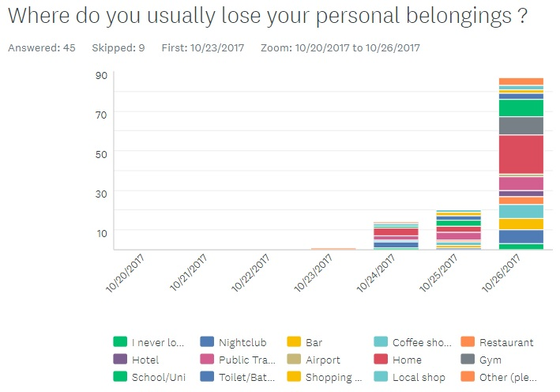
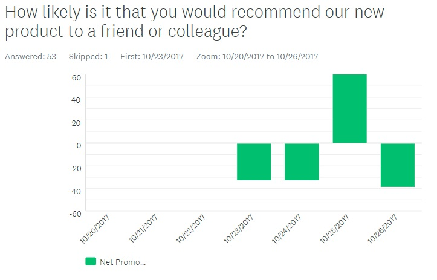
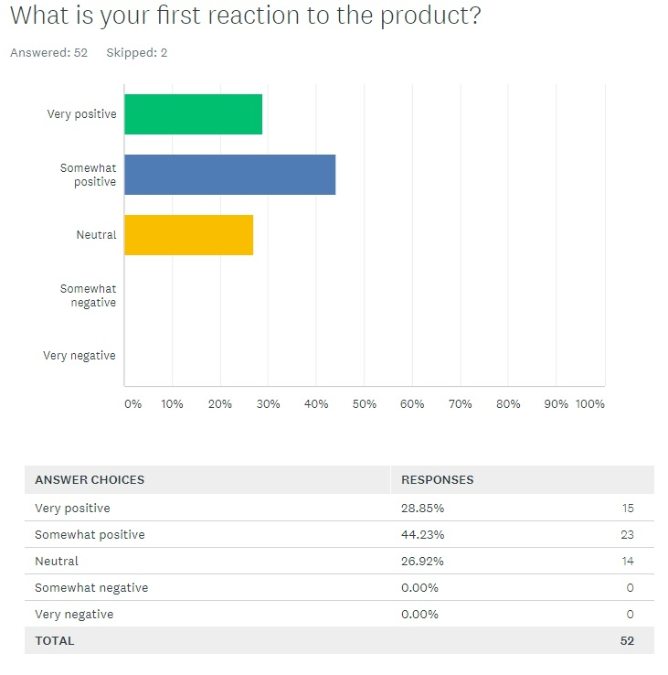
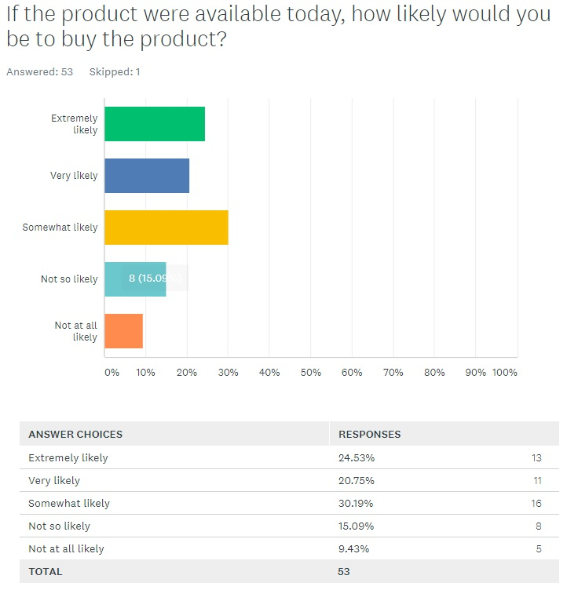
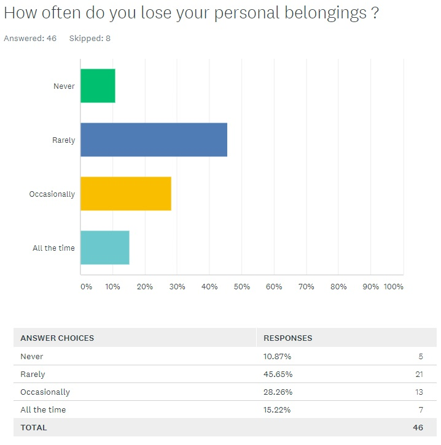
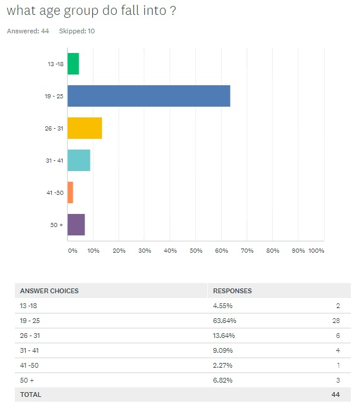

# 12. Appendices

# 1. User Need Overview & Concept Introduction

---

# 2. Data gathering and requirements

## Survey Data









## Stakeholders Report

Stakeholders 
Stakeholders, correlate to anyone that is interested into the product or organisation both internally and externally. 
	
Internal stakeholders
(Direct influence in the business or product)

As our group are the developers of the product, immediately we have direct stake into the product. What do we want to achieve? What we want the outcome to be? How will we market our product? Along with the benefits that the product will have on the clientele/users. The first question to ask is why have we choose upon this project. The project being to create a tag, that will connect via bluetooth. Giving the ability to the users, to tag any important item they are likely to misplace. The tag alerts the user when they have surpassed a certain range, giving us the indication that we need to go back and get that product. The idea was submitted by a group member and thought about by everyone with in the group. We have chosen this idea as we all mislay items usually on a day to day basis. Giving us the attestation to go ahead with this idea as, this is a common issue that occurs with not just us but others. An objective, and the outcome we want to see is to get less people losing items, either temporarily or for good. 

The current team has a group leader picked upon by the group to ensure everything gets done. However, on top of the team leader we have a supervisor. Someone with expertise and great knowledge already in the tech world. Tim, our supervisor will help us drive to the completion of our project along with giving intel and feedback along the way. He is onboard with the idea, as he believes the concept is something that hasn't really been put forward into the market, yet anything similar to it has not established itself to a wide range of people. This tells us that no product similar has broken into the marketing, giving us the ability too. Tim has shown interest due to these regards. 

External Stakeholders
(Anyone outside the organisation or direct users that have influence in the business or product)

Another stakeholder that we have to consider in the future, when the product is established is the government. The government can benefit from the product in a vast amount of ways. However, we ourselves can gain a lender to furthermore develop the product, if we decide to carry this idea furthermore forward. Introducing the product into the market with the right promotion and marketing could lead to the government lending funds. The idea can benefit the government in such a way that, theft of user items are less likely to occur due to the product having a GPS chip. The government will also benefit if we recruit other users as it opens a door for employment. Recruiting, benefits both the recruiter and the new employees, as we share different point of views and skills. Allowing both sides of the party to pick up new skills. Not only is this a benefit for the government but also our current team. 

Our target market currently has been reached out to mainly young adults between the ages of 20 and older. As most market research has been conducted in and around Goldsmiths University of London, we could also say teenagers are another source who will look at investing in our product. As a student, myself one item that I seem to keep losing or forgetting are my keys. Our product will be of interest to the target market as they will have a product which will help them keep safe any item they want. This is convenient as it saves time for users, as they don't have to worry about losing the product and taking the time to search for it. Also, displacing a product and somehow permanently losing it requires people to reinvest into that product. This allows users to also not have to worry about extra costs due to their carelessness. Theft as mentioned before occurs with certain items, such as phones, credit cards, etc. Having the item tagged will allow users to see if they have lost the product or if it was stolen as well. Allowing buyers to retrieve the item or report it. 

## MARKET RESEARCH

I’ve collected the following data going through the actual product websites and other tech related websites as well as going through customer reviews on amazon and google reviews from users who purchased and used these products.

Following items work better in densely populated places like cities.

Product name: TILE  
product website: https://www.thetileapp.com/en-gb/

http://www.techadvisor.co.uk/review/digital-home/second-generation-tile-review-bluetooth-tag-3575574/ 

PROS: waterproof (splashes and rain), 
small design
works via crowd-sourcing. (Tiles communicate with one another, effectively having other users helping you find what you've lost)
Track last location
Ring the alarm things that has the tile on.


CONS: only iOS, 
$19.95/ £20 maybe a little overpriced
Non-replaceable battery
	-estimated to last a year 
(but many customers complains lasting no more than 6 months)
	Privacy invasive software 
-company can and will use the demographic information it collects on you in any way it wants including sharing it with partners. 
-company can find out where u eat, go church, jog etc.
-anyone else who has app, and is near you, will report your location through their phone

What can be improved?
Decrease the price range perhaps.
Increase ring volume 
Use a bigger battery 
Fix privacy problems


Product name: TrackR Bravo (or StickR TrackR) 
product website: https://www.thetrackr.com/ 

PROS: available for both iOS and Android
	Small design
Crowd Source Tracking (similar to tile) if out of range and another TrackR user
gets close to it, will help locate it on your phone
	Ring misplaced item 
	Easy replaceable battery 

CONS: $25/£25 maybe a little overpriced for target users
	The application doesn’t always give accurate information regarding items location
	Too short range (because of bluetooth?)
	The ring tone is quiet, customers complain not being to hear even if nearby
	Complains about Short battery life
	Bluetooth not encrypted (?) therefore privacy issues
   		-which average person may not encounter


What can be improved?
Decrease the price range perhaps.
Increase ring volume 
Use a bigger battery 
Fix privacy problems


Product name: Estimote beacons
product website: https://estimote.com/ 

http://blog.lemberg.co.uk/ibeacon-pros-and-cons-where-begin-programming 

What is it?
Beacons: low energy short range bluetooth transmitter that push notifications to mobile devices that have a designated app for the location.

Anybody has a certain app on devices, whenever they come near these devices(beacons) they get a notification, allows to authenticate presence, send contextual notifications, display proximity-based content

PROS:  Notifies whenever client enters/leaves the tagged  zone (with a beacon) 
-	allows to authenticate presence, 
-	send contextual notifications, 
-	display proximity-based content
Fairly easy to implement
	Low energy consumption (approximately 2 years)

CONS: Safety, once user approves opening of a beacon group, they will open
 without restrictions.
Cannot determine the exact location of the user.
	Might require some programming knowledge


CONCLUSIONS: 
The competing products have advantages as well a disadvantages. 
We can learn from the customers complains and try to improve the user experience from those. For example one core issue is privacy.
 A problem that more or less all the above products have. As Hussein suggested.

‘privacy may be a concern but we can leverage this as our USP (Unique Selling Point) all data (names and location of items) is stored locally on the phone/watch - its not on the "cloud" and can easily be encrypted’  by Hussein Farakhani.

Also a solution regarding battery life, as many don’t seem to be long lasting.

---

# 3. Functional Specification

---

# 4. Ethical audit 

---

# 5. Design

## 5-1. Use Cases Details

### Use case 1: Log trackers

#### Basic Flow

  1. User attachs Tracker to a personal item.
  1. App links to Tracker with bluetooth.
  1. App activates Tracker.
  1. User logs details of the item and Tracker in App.
  1. App validates and saves the inputs.

#### Alternative Flows

[Multiple Trackers]
After Step 4, repeat step 1 to 4 for additional Trackers and items.

### Use case 2: Monitor Tracker

#### Basic Flow

1. App listens for signal at regular intervals.
1. App saves the history of the position of Tracker at regular intervals.

#### Alternative Flows

[Tracker is with user]
Tracker is within certain distance from User:

1. App listens for bluetooth singal.

[Tracker is lost]
Tracker is not within certain distance from User:

1. App activates Tracker's cellular mode via bluetooth.
2. App sends a notification to mobile OS to nofity User.
3. App listens for the geolocation data of Tracker sent from Server.

[Tracker is nearby but not with User after being lost]
Tracker is within bluetooth dectable distance after being far away from User :

1. App activates Tracker's bluetooth mode via Server.
1. App listens for the geolocation data of Tracker sent from Server and bluetooth singal at the same time.

[Tracker is with User after being lost]
1. App deactivates Tracker's cullular mode via bluetooth.

Resume at Base Flow step 1.

### Use case 3: Track Item

#### Basic Flow

1. User selects desired tracking item in App.
1. App displays the position data of Tracker.

### Use case 4: Send position data

#### Basic Flow

1. Tracker sends position data to App.

#### Alternative Flows

[Activates Cellular mode]
Tracker's bluetooth signal is not reaching App after a period of time: 
1. Tracker activates cellular mode.

[Bluetooth mode is activated]
Tracker sends position data via bluetooth to App.

[Cellular mode is activated]
1. Tracker sends position data via cellular to Server.
1. Server transfer the position data to App.

### Use case 6: Register account

#### Basic Flow

1. User input account details.
1. App validates the inputs.
1. App creates a new account.

#### Alternative Flows

[Inputs are validated failed]
After step 2, resume at step 1 if the inputs are not validated.

### Use case 7: Login account

#### Basic Flow

1. User input account details.
1. App validates the inputs.
1. App allows User to login.

#### Alternative Flows

[Inputs are validated failed]
After step 2, resume at step 1 if the inputs are not validated.

---

# 6. Prototyping

# Hardware Research

## Bluetooth Component module
Bluetooth has established itself as the wireless communication standard of choice to connect wearable devices to smartphones, tablets or PCs, 

The SESUB-PAN-D14580 module, which is based on TDK's SESUB (semiconductor embedded in substrate) integration technology, features an embedded DA14580 Bluetooth 4.1 chip from Dialog Semiconductor. All terminals of the discrete chip are available, allowing full use of chip functions

The module features an integrated DC-DC converter. With a voltage supply of 3.0 V, its current consumption is only 5.0 mA when transmitting, 5.4 mA when receiving and 0.8 µA in standby mode. 

The ultra-compact dimensionsTDK SESUB-PAN-D14580 module are just 3.5 mm x 3.5 mm x 1.0 mm.

### Main features and benefits

* Ultra compact module dimensions of 3.5 mm x 3.5 mm x 1.0 mm (typical) drastically reduces the mounting footprint to only about 12 mm2
* Easy implementation of Bluetooth connectivity
* Integrated DC-DC converter

## Active RFID tag

Active RFID systems have three essential parts – a reader or interrogator, antenna, and a tag. Active RFID tags possess their own power source – an internal battery that enables them to have extremely long read ranges as well as large memory banks.

Typically, active RFID tags are powered by a battery that will last between 3 – 5 years
Essentially, two different types of active RFID tags are available – transponders and beacons.

### Transponders
In a system that uses an active transponder tag, the reader (like passive systems) will send a signal first, and then the active transponder will send a signal back with the relevant information. Transponder tags are very efficient because they conserve battery life when the tag is out of range of the reader. Active RFID transponders are commonly used in secure access control and in toll booth payment systems.

### Beacons
In a system that uses an active beacon tag, the tag will not wait to hear the reader’s signal. Instead, true to its name, the tag will ‘beacon’, or send out its specific information every 3 – 5 seconds. Beacon tags are very common in the oil and gas industry, as well as mining and cargo tracking applications. Active tag’s beacons can be read hundreds of meters away, but, in order to conserve battery life, they may be set to a lower transmit power in order to reach around 100 meters read range.

### Estimote
An Estimote Beacon is a small, wireless device, when placed in a physical space, it broadcasts tiny radio signals to smart devices.

Estimote Beacon is like a small computer. Its 32-bit ARM® Cortex M0 CPU is accompanied by accelerometer, temperature sensor, and what is most important—2.4 GHz radio using Bluetooth 4.0 Smart, also known as BLE or Bluetooth low energy. This is able to provide mobile devices in range with information about their location and state.


Estimote is an iBeacon-compatible hardware transmitters, using the idea of smart objects that work as transmitter to broadcast digital data using Bluetooth Smart protocols:
	
	•	Eddystone UID
	•	Generic Advertiser
	•	Nearable
	•	Estimote Monitoring
	•       iBeacon


iBeacon is a Bluetooth advertising protocol designed by Apple, with native support in iOS, a specification that tells what data, and in what format, a Bluetooth beacon needs to advertise.
Estimote Monitoring is the default protocol in both Location and Proximity Beacons and it was built as a mix of Estimote Location and iBeacon, taking the best features of both protocols. It offers various improvements in accuracy and beacon detection and is currently the most reliable protocol

### Pros

* Extremely Long Read Range
* Increased tag abilities with partnered technologies (GPS, sensors, etc.)
* Extremely Rugged tag options

## IBeacon Technology (Bluetooth Low Energy Tags)

### Accessibility
With smartphones primarily acting as receivers, beacons form a highly accessible indoor location technology.

Pros: The capability of beacons to allow smartphones to primarily act as the receivers, makes it a highly accessible location technology

Cons:Beacons once installed need to be checked regularly for battery levels, making this less practical.

### Range
Beacons typically have a wireless range of 1m to 70m

Pros: Beacons typically have a wireless range of 1m to 70 m

### Accuracy
Beacons being radio transmitters are not very accurate as they stand the chance of interference, as radio signals can be absorbed by different media, such as water, air, human bodies or even metallic surfaces
Cons: Beacons being radio transmitters are prone to suffer from interference

### Security

Pros: No intrinsic security risks. Since beacons are primarily proximity detection devices that broadcast outbound signals, there is no inherent security risk in the transmission.

Cons: The Signals sent out by beacons can be intercepted and used by hackers. Most manufacturers have built in countermeasures that attempt to counter this.

### Cost 

While beacons by themselves are relatively cheap (a typical beacon would cost you anywhere between £5 to £50), the number of beacons required depends on the size of the space and range needed. The cost of beacon system depends on several other factors such as app and integration cost, licensing and data service cost. 


## Side note – Bluetooth 5

Although I don’t believe Bluetooth 5 is currently established, I’m going to include these notes. The Bluetooth 5 update will bring:
* 4x the range
* 2x the speed
* 800% more broadcast messaging capacity


## Cellular

A great advantage of cellular is its long range, it comes second to GPS for range. Our product will be used in an unpredictable urban environment. Cell phone towers are everywhere in an urban and even sub-urban environment. Cellular requires less energy than Wi-Fi and does not require a WPA/WEP key (or any other login system) to fully exploit. 

However, a tracker using Cellular will require a bigger antenna than what a wi-fi tracker currently uses. During research we discovered whenever a tracking device was using Cellular networks it was in fact using 2G (3G, 4G etc.) to connect to the internet (this is expensive and defeats the purpose of using cellular in this context). What we really want is a Cellular tracker to use triangulation from different cell phone towers to pinpoint its own location.

Government agencies such as intelligence services and emergency services use Cellular triangulation, through our research we found that it would not be possible to implement cellular triangulation in the same way Government/emergency agencies do, we lack expertise knowledge, resources and connections.

But, we have found a “middle-man” who can, so to speak. SkyHook, the same location provider Apple uses, also provide cell phone triangulation using a map of cell phone towers, they also use the same technique with wi-fi hotspots. 

## Acoustic Location

Sound waves travel at an average 343 m/s. By detecting the time taken for the phone (which is what the user interacts with) to detect a sound (which is an inaudible frequency emitted at regular time intervals by the tracker) we can work out the average location of the tracker: distance (m) = speed(m/s) * time (s).

A unique approach, its currently only extensively used by the military and emergency rescue teams. The problem is that the product environment (chaotic Urban) has to much sound interference, this will severely limit the smartphones microphone ability to distinguish the inaudible frequency emitted by the tracker. We also need more than one “listening” device to make triangulation possible.

In environments were acoustic location is possible, high grade/ large microphones are used and they are normally used in an open or quieter environment than a chaotic urban environment which this product is designed for.

## Hybrid Server Side – SkyHook implementation 

Whatever device (android, iOS, wearable, any modern operating system) SkyHook can use the device Wi-Fi/cellular/GPS capability and to find the precise location of the device. It does this by mapping wi-fi hotspots, cell phone towers and/or GPS which the device comes across. By using this map, SkyHook can triangulate the location of the device, thus providing a precise location.  The iPhone location capability is actually provided by SkyHook. 

The device, in this case our product, the SkyHook APK maps nearby WI-FI hotspots and cell phone towers and use this data to triangulate were the location of the device is. It can also add GPS data (but our product may not have GPS capability) 
SkyHook is only part of the product, a tracker still needs to interact with SkyHook’s servers.

SkyHook data is stored in the United States raising privacy concerns, however SkyHook has “Skyhook has certified to the EU-U.S. Privacy Shield Framework for the transfer of Personal Information from the EEA to the United States” so we can still deploy using SkyHook
### https://www.privacyshield.gov/participant?id=a2zt0000000KzW8AAK&status=Active 21/11/17   21:15


## RFID (Radio Frequency Identification) systems 

Passive RFID systems use tags with no internal power source and instead are powered by the electromagnetic energy transmitted from an RFID reader.

Made up of two main components – the tag’s antenna and the microchip or integrated circuit.

There are three main frequencies within which passive RFID tags operate:
125 – 134 KHz – Low Frequency (LF) range : 1 – 10 centimeters.
13.56 MHz – High Frequency (HF) & Near-Field Communication (NFC)			range: 1 centimeter up to 1 meter.
865 – 960 MHz – Ultra High Frequency (UHF)  range:  5 – 6 meters


## Pros of Passive RFID:
Smaller tags
Much cheaper tags (starting from £1 - £20+) 
Thinner/more flexible tags
Higher range of tag options
Tags can last a lifetime without a battery (depending on the wear and tear)

## Cons of Passive RFID:
The tag can be read only at short distances.
Passive tags have difficulty sending data through liquids or metal.
The orientation of a passive RFID tag must be just right or the reader won't locate it.


## Active RFID systems use battery-powered RFID tags that continuously broadcast their own signal (like a cell phone).

Made up of three essential parts – a reader (or interrogator), antenna, and a tag.


There are two main frequencies used by active systems – 433 MHz and 915 MHz

 Pros of Active RFID Tags:

Extremely Long Read Range
Increased tag abilities with partnered technologies (GPS, sensors, etc.)
Extremely Rugged tag options
It can have more memory to, store more data.
Cons of Passive RFID:	
Sensitive to harsh environment
Costs more (starting from 15/20£ a piece)
Larger size and weight.

## Conclusions:
Either RFID system has advantages and disadvantages of their own, depending on needs. 

Speaking for our purpose an active ultra-wideband (UWB) RFID system, would be able to determine a tagged objects location within few inches. But UWB tags are really expensive.

A passive UHF RFID system can provide about 5 - 10 metres of read range (distance from which a reader can communicate with tag). These can tell the tag is within a read field, but not specifically where within the field.

Passive RFID system uses something called Received Signal Strength Indicator (RSSI) to determine how close the tagged object is to the RFID interrogator. RSSI can’t tell if tag is, for example 20 cm away, but it can tell if tagged object is getting closer or further away.


## Arduino GPS

There are many Arduino GPS hardwares out in the market that are buyable. The prices of the GPS Arduino hardwares depends on usually the spec that they have. The hardware will be incorporated with the other features that our initial product will carry. Looking into the market, not one GPS Arduino hardware is perfect, however some excel above all the others. Popular builds so far for the Arduino GPS have been the Copernicus, LS23060, D2523, SUP500F, MN5010 (uMini) and EM-406A. All if not most GPS, are connected via satellites, to get a broad understanding of how each of these look and what they display on a map it is best recommend to configure Google 2D Maps along with a side to side 2D analysis. 

The one flaw that these GPS Arduino hardwares have is that inside a structure the signal might not give off an accurate pinpoint location.

Image Source: https://www.sparkfun.com/tutorial/GPSTracking/gpsinside-M.jpg

This image shows why at first call someone should not use a GPS Arduino hardware inside as signals are distraught. Also why someone should not try to access a area inside a structure even if they are outside. The different colours are the different modules that are mentioned above and how they react to finding a location from inside a structure or a location in the structure. However, there is a likely solution for this. You can attach other elements to the Arduino GPS hardware, a user will have to program a solution on how to make the signals content and not overly responsive. This is only for
being able to use the Arduino GPS hardware from inside a structure. Coding something to pinpoint a location within a structure is far more complicated.


| Name of Modules  |Price   |Pro's   |Con's   |
|---|---|---|---|
| Copernicus  | £56 | - Basic Understanding of code, at least be able to code serial or TTL. - One of the most accurate and reliable modules. - It evaluates data in all conditions.   | A good understanding of electrical prototyping as user will need to know how much power is required, what each pin does, how to hook up the hardware, etc.   |
| LS23060  | £45 | - This requires a good understanding of code, at least be able to code serial or TTL. -Tracks longitude and latitude in all conditions. -This module also has a good evaluation in all conditions.   | - A well understanding of electrical prototyping due to users needing to know how much power is required, what all the pins do, and how to hook up the hardware, etc. - User should be able to solder to a high standard as this is a small hardware. - Users might need to make their own cable. |
| D2523  | £60  | - This requires a well round understanding of code, at least be able to code serial or TTL. - Good at places where it is hard to get a signal due to certain conditions such as a high source of dielectric materials. - Excellent latitude and longitude when the sky is clear. Similarly with data evaluation.  | A well understanding of electrical prototyping due to users needing to know how much power is required, what all the pins do, and how to hook up the hardware, etc. - User should be able to solder to a high standard as this is a small hardware. - Users might need to make their own cable.|
| SUP500F  | £35 | - The hardware (module) is very small. - Due to its size, it also does not take too much power. | - Not having a lot of power can also be an disadvantage. |
| MN5010 (uMini) | £55 | - This hardware is also very small, therefore it does not take up a lot of space. - Allows both hot start and cold start. | - Connection is not as accurate as it uses chip antenna. |
| EM-406A  | £48 | - Allows for all 3 start up times.  | - Requires and will take up a lot of power. - Likely to be interference due to it connecting via chip antenna.  |

---

# 7. Technical Architecture

---

# 8. Evaluation Plan

---

# 9. Project management


## 9-1 Project Tasks List


## 9-2 Meeting notes

### Weekly Routine

|Time| Task | Task Description | Total Duration |
|---|---|---|---|
Tuesday Morning | Lab Meeting | Report everyone's previous working status and plan for the Individual Working Slot 1. | 1 hour
Tuesday to Thursday | Individual Working Slot 1 | Working on the plan discussed in Lab Meeting. | 4 hours
Friday Noon | Supervised Meeting | Report the working result and consult with the supervisor. | 0.5 hour
Friday to Monday | Individual Working Slot 2 | Improve one the working result based on the Supervised Meeting. |  4 hours

### Supervised Meeting - 7/12/2017

* Walked through the proposal requirements.
* Tim suggested us to 
	* Build a wood made tracker as a physical usage prototype to test the usage of our tracker. 
	* Add extreme tests in the evalutaion section

### Lab Meeting - 5/12/17 

* Have asked hatchlab about purchasing hologram.
* Need to buy hologram on our own.
* Discuss what to do during the Christmas break on 12/12.

### Supervised Meeting - 30/11/2017

* Grilled over the technical diagrams.
* We need to catch up on hours.
* Tim likes our project.

### Supervised Meeting - 24/11/2017

* Tim said: "Where are the prototypes???" 
* The meeting time has now changed to Thursday 12:00.
* Suggestion: 
	* Separate the process diagram into different part to fit them in the proposal.

### Lab Meeting - 21/11/2017

* How to integrate Skyhoot:  @hussein159 works on that.
* Platform: Android
* Functional Prototype: @hussein159 works on that.
* To put data privacy issue in proposal while using the skyhook or any cloud service.

### Supervised Meeting - 17/11/2017

* Updated progress tracking form with milestone / tasks.
* People who commit more will have more marks, please record your effort on the progress tracking form and proactively pick the tasks if you need more marks.
* Changing time of the meeting may be quite difficult.
* Tim suggested to host another meeting time during the week apart from the lab.

### Supervised Meeting - 03/11/2017

* What we've done:
	* Meeting with Pete.
	* Hardware research.
	* About to attend the hatch lab induction.

* What we have not done:
	* Improve the previous report.
	* Estimote testing report.

### Meeting with Pete - 31/10/2017

* To discuss: 
	* Anyway to improve on our idea?
	* Any suggestion on the hardware?
	* How to compete with competing products?


### Supervised Meeting - 27/10/2017

* Try to build a prototype before next meeting.
* Search what's the techniques the existing products use.
* Search what can we use to provide the service.
* Because of age-related memory loss, the elders or middle age people could be our target customers.


### Supervised Meeting - 20/10/2017

* Progress suggestions
	* Before next week: potential user (Draft personas?)
	* Setup a questionnaire to ask who are our users? 

* Preparing for next time:
	* Bring the lab doc / track form (hard copy of the progress sheet).
	* Sketch Functional Architecture 
	* Make sure the requirements are met before next week.
	* Use case senario.
	* Completed resource form.
	* Do the questionnaire in: 
	  * Cafeteria
	  * Costa
	  * Family
	* Think about project names?


### Extra Meeting - 19/10/2017

* Topic decided: **Lost item tracker**
* Product name
	* findME
	* BlueJ
	* locate.
	* Lost.
	* LocationRanger


## 9-3 Progress Tracking Form (until 10/12)

Label Name | Description
|---|---|
WBS Code | Work break down code, which indicates the category of the work for.
Date | The working date.
Status | The detail of the work.
Resource Name(hour) | Usage of the resource(s) in hours.


## 9-4 Progress Tracking Charts (until 10/12)

### Cumulate Line Chart


### Sum Column Chart


## 9-5 Project Management Tools Details

| Platform | Usage
|---|---|
| Slask | Inner communication.
| Trello | Divides and assigns weekly tasks. (depreciated)
| Trello | Records weekly meeting notes.
| Google Spread Sheet| Progress tracking form.
| Google Spread Sheet | Gantt Chart.
| Google Spread Sheet | Project Tasks List.
| Github | Manage source code and report with fixed workflow.
| Github | Use issue feature to track developing progress.
| Github | Record weekly reports.

## 9-6 Github Directories

* `/documents`: The reports for each week progress.
* `/proposal`: Paragraphs for each section of our first report
* `/src`: software/hardwares source code.
* `/presentations`: Slides for the presentation in March.
* `/final-report`: Paragraphs for the final report.

## 9-7 Github Work Flow

If you want to update any document or source code in the repository, please follow **the work flow** and the **naming convention** to maintain the consistency.

### tl:dr

1. [Issue](#1issue)
1. [Branch](#2-1-check-out-the-branch)
1. [Work](#3-work)
1. [Commit](#4-commit)
1. [Push & pull request](#5-push-pull-request)

### 1.Issue

Before you start to work on either document or source code, make sure you **browse the issue section** to see if there is already an existing issue related to what you're going to work on. If you found one, than go to [step 2-1](#2-1-check-out-the-branch). 

If there is no such issue you're looking for, **create a new one then**. Condense the title and add more details in the description. Add the correct label to it and assignees as well. 

> [Read more about the issue labels](#issue-labels)

### 2-1. Check out the branch

Check out the corresponding branch on your local working space. If the issue you found is `#13`, then the branch name should be like `issue-#13-xxxx`. `xxxx` can be `fix` or `update`.

### 2-2. Create a new branch based on that issue.

If you can't find the issue about what you need to work on, create a new one on your own. Here is the naming convention:

`issue-#[ISSUE NUMBER]-[ACTION]`

* NUMBER: the number of the corresponding issue.
* ACTION:
  * `update`: for report updating or feature updating, mainly for something continuously updating.
  * `fix`: for fixing a bug or typo, mainly for something happen one time only.

### 3. Work

As title, work on your branch and make sure you're on the right branch already. You can use `git branch` to check it.

### 4. Commit

To commit, here is the commit message:

```
[TYPE]: [SUBJECT LINE]

[DESCRIPTION]

[ACTION] #[ISSUE NUMBER]
```

* `TYPE`: `Update` or `Fix`. same as the `ACTION` on the branch name
  * `Update`: for report updating or feature updating, mainly for something continuously updating.
  * `Fix`: for fixing a bug or typo, mainly for something happen one time only.
* SUBJECT LINE: briefly describe your changes. 
* DESCRIPTION: describe the change in more details.
* ACTION: 
  * `Close`: to close of the branch and the issue forever (theoretically).
  * `Update`: there should be future updating continuously.
* ISSUE NUMBER: the issue number.

#### e.g. Update the report 

```
Update: Rewrite the project concept.

Condense the project concept and add two new diagrams.

Closes #1234
```

#### e.g. Fix a bug

```
Fix: Added missing header

The app header was deleted accidently, added it back.

Closes #12345
```

> Please review your change before every commit, which will massively reduce the possibility of finding bugs or typos after push the commit.

### 5. Push & pull request

After you push your commit, make a pull request on Github. Everyone can review your change and add comment. After reviewing I will either merge it to the master or ask you to do some change.

### Issue labels

Here are the categories of the issue labels, one issue can be assigned **one or more** labels.

|     Label Name     |                                      Description                                       |
| ------------------ | -------------------------------------------------------------------------------------- |
| final report       | related to final report.                                                               |
| enhancement        | software functionality enhancement.                                                    |
| bug                | software bugs.                                                                         |
| hardware           | hardware related.                                                                      |
| presentation       | related to the presenation.                                                            |
| project management | anything related to the project magement                                               |
| proposal           | related to the proposal content.                                                       |
| weekly documents   | weekly unsorted records.                                                               |
| report             | anything related to text, including `final report`, `proposal` and `weekly documents`. |

## 9-8 Roles

### Project Manager

* Members
  * Jheng-Hao
  * Hussein
* Duties
  * Lead the discussion lab meeting and supervised meeting.
  * Divide tasks.
  * Monitor developing progress.
  * Maintain workflow and Github repository.

### Project Member

* Members
  * Muhammad
  * Thairan
  * Dylan
  * Mahmudul
  * Hussein
  * Mariano
* Duties
  * Contribute to overall project objectives.
  * Complete individual task.


---

# 10. Conclusion
