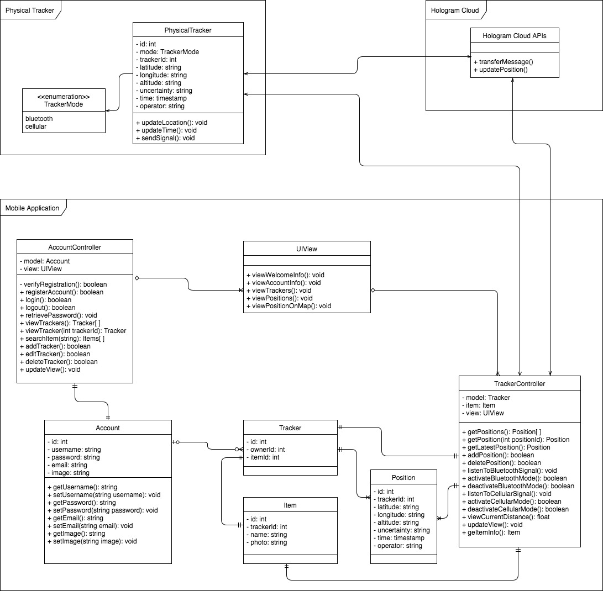
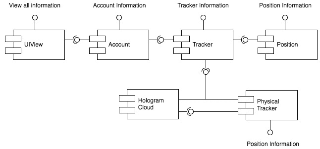

# 7. Technical Architecture

The product contains three parts: a mobile application, a physical tracker and the Hologram Cloud as the server. Hologram Cloud provides various built-in functions which allow us to focus on developing the mobile application and the tracker. Due to the privacy issue, our application doesn't store any data in the cloud server or database but in the user's mobile phone only.

Here we provide three kinds of views in different diagrams. The process view won't be shown here because it is same as the activity diagram in the Design section.

## Logical View

The logical View diagram is based on our main architecture split into three parts: Mobile application, Hologram Cloud and Physical Tracker, and mobile application are our main focus. The architecture is based on MVC pattern, one point worth mentioning is that there are three models (Account, Tracker and Position ) while two controllers only(AccountController and TrackerController). The reason is that the Position data will be immutable and directly transferred from either Hologram Cloud or Physical Tracker, and binding the data flow with TrackerController simplify the whole routine.

The class of Hologram Cloud is simplified, because it comes with complex APIs and the most important function and the related functions are transferring message and updating position. The getters and setters are omitted due to the readability.

## Development View

With development view, we can understand the data flow and what are the data should each component provide from a software engineer's perspective. This helps us to build a more abstract understanding of our project.

## Physical View

The physical view is demonstrated in a deployment diagram and shows the physical structure clearly. With this diagram, we could have a more clearer overview of the whole service.
