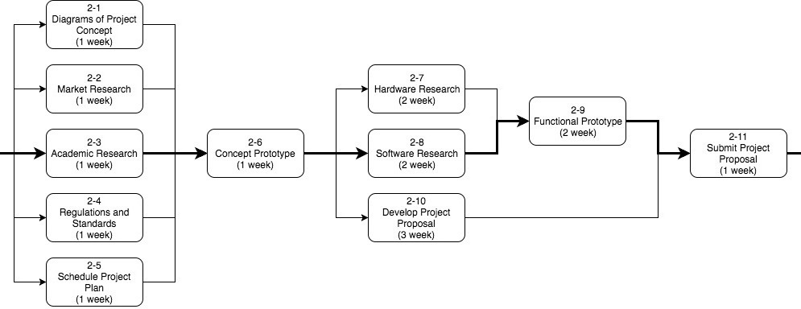
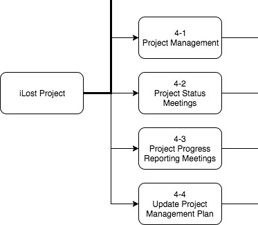

# 9. Project Management

## Project Cycle

Our project cycle contains the five process groups of Initiation, Planning, Execution, Control and the Closeout[1].

* Initiation: confirming the project concept, personas and user needs.
* Planning: researching technology and developing the proposal.
* Execution: developing the minimum viable product and final production.
* Control: project management and the weekly meetings.
* Closeout: developing presentation and final report.

There are three milestones in the project cycle:

Milestone Name | Description | Stage
|---|---|---|
Project Proposal | After submission of the project proposal. | End of Planning
Project Application |  Finish the application production. | End of Execution
Project Final Proposal | After submission of the project final proposal. | End of Closeout

Please find more details of the tasks and milestone in the appendices 9-1.

## Project Diagram

The progress diagram is divided into five parts based on the project task list.

### 1. Initiation

### 2. Planning

### 3. Execution

### 4. Control

### 5. Closeout

## Gantt Chart

With the project tasks sheet and estimated working duration, we produce the Gantt chart and the developing diagram, which allow our teammates to see the developing progress clearly and easily.

## Weekly Routine

We use a week as a minimum developing unit to measure and schedule the developing process, which is more feasible than using day and more precise than using a month. There are two working slots and two meeting weekly.

|Time| Task | Task Description | Total Duration |
|---|---|---|---|
Tuesday Morning | Lab Meeting | Report everyone's previous working status and plan for the Individual Working Slot 1. | 1 hour
Tuesday to Thursday | Individual Working Slot 1 | Working on the plan discussed in Lab Meeting. | 4 hours
Friday Noon | Supervised Meeting | Report the working result and consult with the supervisor. | 0.5 hour
Friday to Monday | Individual Working Slot 2 | Improve one the working result based on the Supervised Meeting. |  4 hours

The meeting notes can be found in the appendices 9-2

## Progress Tracking Form

To track the resource usage easily, we created Google spread sheet, which allows our group members to record their efforts and categorise their working status.

Label Name | Description
|---|---|
WBS Code | Work break down code, which indicates the category of the work for.
Date | The working date.
Status | The detail of the work.
Resource Name(hour) | Usage of the resource(s) in hours.

We also make a chart develop a line chart and a column chart, which visualise the statics automatically based on the resource usage.

Please read find the full progress tracking form and charts in appendices 9-3 and 9-4. 

## Project Management Tools

Slack, Trello, Google Spread Sheet and GitHub are our main project management tools to fulfil various developing needs.

| Platform | Usage
|---|---|
| Slack | Inner communication.
| Trello | Divides and assigns weekly tasks. (depreciated)
| Trello | Records weekly meeting notes.
| Google Spread Sheet| Progress tracking form.
| Google Spread Sheet | Gantt Chart.
| Google Spread Sheet | Project Tasks List.
| GitHub | Manage source code and report with fixed workflow.
| GitHub | Use issue feature to track developing progress.
| GitHub | Record weekly reports.

After using GitHub to record our weekly reports and cooperate on proposal, it's not necessary to use Trello. Because GitHub has most of the features we need from Trello, such as lists, labels, and milestones are all on GitHub. We are considering to replace Trello with GitHub completely in the next stage.

We have set up a specific workflow and standard to maintain our commitment format and readability. Please find more details about GitHub repository and workflow in appendices 9-5 and 9-6.

## Roles

In our group, there are only two types of roles: project manager and project team member. Still, there are an only small amount of people in the group, so it's inevitable for the project manager to do the same duties as the project member.

### Project Manager

* Members
  * Jheng-Hao
  * Hussein
* Duties
  * Lead the discussion lab meeting and supervised meeting.
  * Divide and assign tasks.
  * Monitor developing progress.
  * Maintain workflow and source code repository.
  * Proactively motivate groupmates to work on tasks.

### Project Member

* Members
  * Muhammad
  * Thairan
  * Dylan
  * Mahmudul
  * Hussein
  * Mariano
* Duties
  * Contribute to overall project objectives.
  * Complete individual task.
  * Provide expertise
